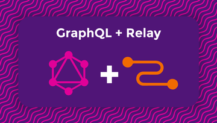

footer: © NodeProgram.com, Node.University and Azat Mardan 2018
slidenumbers: true
theme: Simple, 1
build-lists: true
autoscale:true

[.slidenumbers: false] 
[.hide-footer]

---

# Node Advanced
## Overview
### Azat Mardan @azat_co

---

# Node Advanced

* Videos: <http://node.university/p/relay-modern>
* Slides: in `*.md` in <https://github.com/azat-co/relay-modern>
* Code: in `code` in <https://github.com/azat-co/relay-modern>

---

# Course Overview

1. Introduction
2. Relay Modern Configuration and Setup
3. Connecting Relay Modern to GraphQL
4. Extending the Component Tree with Fragments
5. Working with a Collection of Data
6. Performing Mutations with Relay Modern
7. Advanced Relay Modern Features

